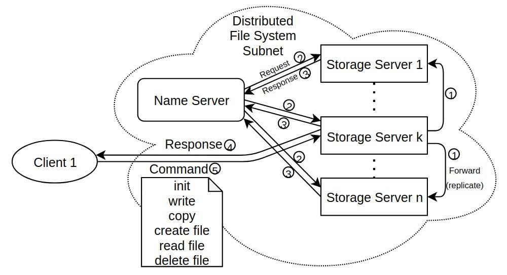
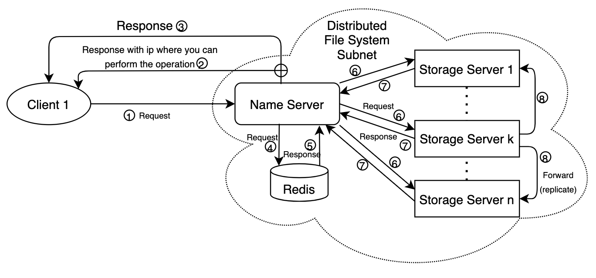

# Plenilune

## Project description
Plenilune is the distributed file system(DFS), a file system with data stored on a server. The data is accessed and processed as if it was stored on the local client machine. The DFS makes it convenient to share information and files among users on a network. 

## Required instalations
[Docker](https://www.docker.com), [Docker hub](https://hub.docker.com/):
```bash
sudo apt-get update
sudo snap install docker
```
Installation of Name Server ([docker image](https://hub.docker.com/r/rizatdinov/name_server))
```bash
docker pull rizatdinov/name_server
docker compose up --build -d
```
Installation of Storage Server ([docker image](https://hub.docker.com/r/rizatdinov/storage_server))
```bash
docker pull rizatdinov/storage_server
docker-compose up --build -d 
```
Installation of Client ([docker image](https://hub.docker.com/r/rizatdinov/client))
```bash
docker pull rizatdinov/client
docker-compose up --build -d 
```

## Usage guide
To start run commands you need to enter client container bash:
```bash
docker exec -it <client-container-name> bash
python client.py <command>
```
Available commands can be find by ```--help``` command:
```bash
python client.py --help
```


## DFS Structure

On this figure you can see that clients and DFS system are separated.  
DFS nodes are in isolated private subnet for security purpose.   
Naming server is a main node that is responsible for managing incoming requests, processing them and giving all needed information to client. Also it knows all about servers(state, info).  

## Initialization of DFS


## Client Interaction

When a client wants to do any command from the list described earlier, it:

1. Chooses the command for specific operation
2. Contacts the naming server, then naming server can send 2 variant of response(3 or 4)
3. If client wants to do any operation connected to the file: read, write, create, delete, etc, it sends the information about storage server, where client can get what he wants.
4. If client wants to see the status of DFS, see/change directory structures, it applies all changes and responses to the client.
5. If 3rd point was chosen, then client contact the storage server.
6. This storage server replicates the changes to other storage servers.

## Storage Server Interaction


## Name Server Interaction


## Description of communication protocols
For communication we use ```requests``` library which simplifies HTTP requests  
All nodes use jsons for communication: ```{'arg[1]':'arg[1]_value', ..., 'arg[n]': 'arg[n]_value'}```   
which are inside reqests functions: ```requests.<command>(<url>, json)```  
For example, file copying:
```bash
requests.get(f'http://{name_server_address}/file/copy', {"filename": filename, "destination": destination})
```
Servers send response messages:  


### Team members:
* Kamil Rizatdinov
* Rufina Talalaeva
* Alina Paukova
