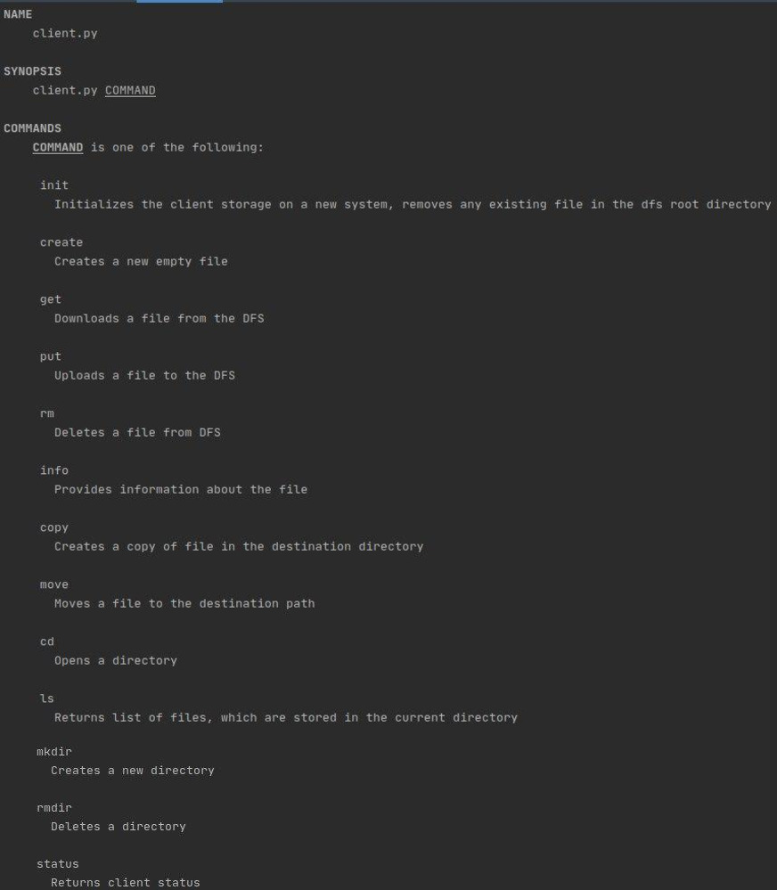
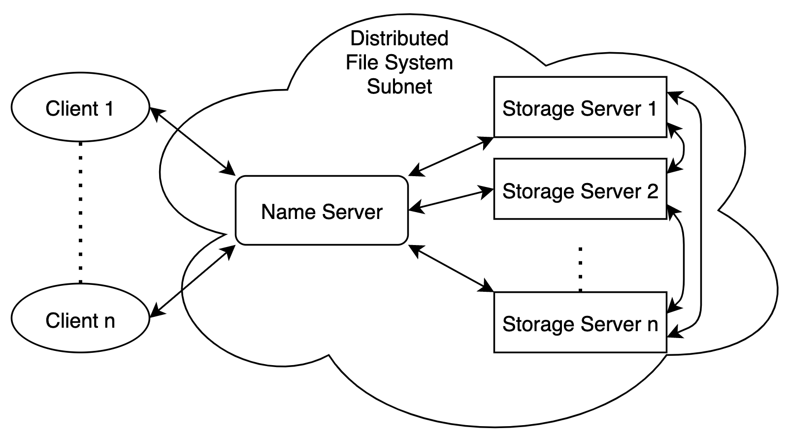
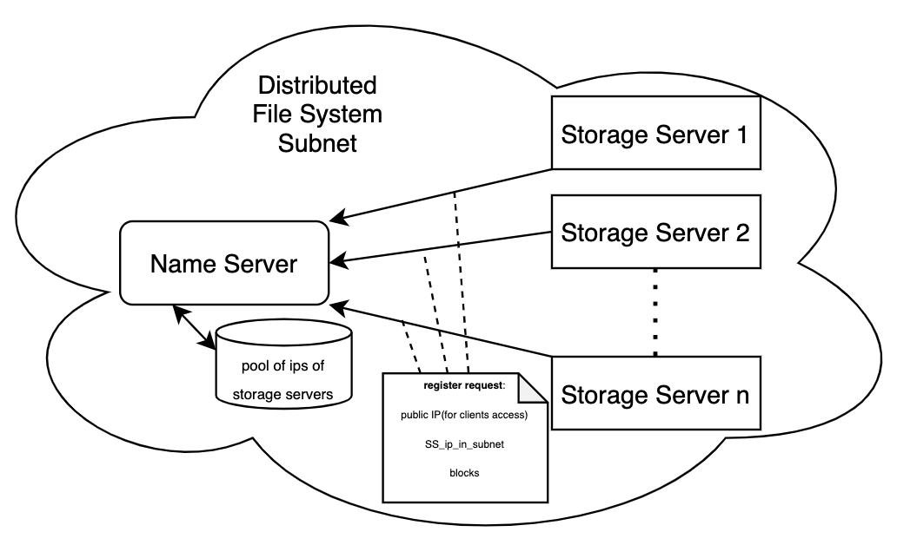
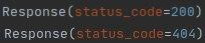

# Plenilune team

### Team members:
* Kamil Rizatdinov
* Rufina Talalaeva
* Alina Paukova

## Project description
Plenilune is the distributed file system(DFS), a file system with data stored on a server. The data is accessed and processed as if it was stored on the local client machine. The DFS makes it convenient to share information and files among users on a network. 

## Required instalations
[Docker](https://www.docker.com), [Docker hub](https://hub.docker.com/):
```bash
sudo apt-get update
sudo snap install docker
```
Installation of [Name Server](https://hub.docker.com/r/rizatdinov/name_server):
```bash
docker pull rizatdinov/name_server
docker compose up --build -d
```
Installation of [Storage Server](https://hub.docker.com/r/rizatdinov/storage_server)
```bash
docker pull rizatdinov/storage_server
docker-compose up --build -d 
```
Installation of [Client](https://hub.docker.com/r/rizatdinov/client)
```bash
docker pull rizatdinov/client
docker run —name client -itd rizatdinov/client
```

## Usage guide
To start run commands you need to enter client container bash:
```bash
docker exec -it client bash
python client.py <command>
```
Available commands can be find by ```--help``` command:
```bash
python client.py --help
```



## DFS Structure


## Initialization of DFS



## Description of communication protocols
For communication we use ```requests``` library which simplifies HTTP requests  
All nodes use jsons for communication: ```{'arg[1]':'arg[1]_value', ..., 'arg[n]': 'arg[n]_value'}```   
which are inside reqests functions: ```requests.<command>(<url>, json)```  
For example, file copying:
```bash
requests.get(f'http://{name_server_address}/file/copy', {"filename": filename, "destination": destination})
```
Servers send response messages:  

