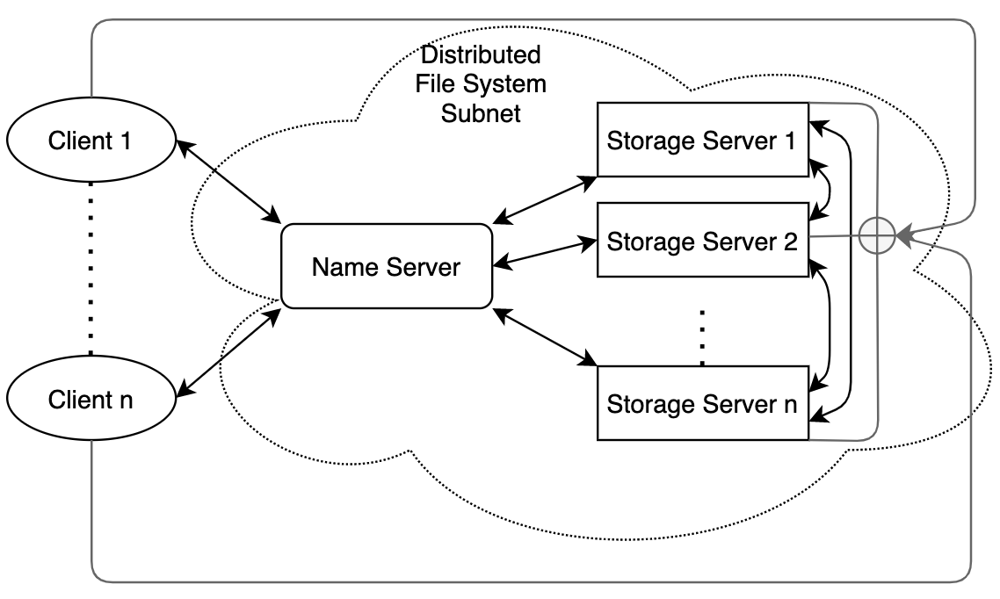
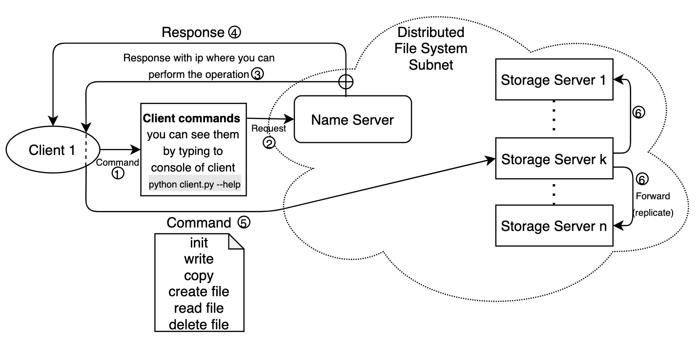

# Plenilune

## Project description
Plenilune is the distributed file system(DFS), a file system with data stored on a server. The data is accessed and processed as if it was stored on the local client machine. The DFS makes it convenient to share information and files among users on a network. 

## Required installations
[Docker](https://www.docker.com), [Docker hub](https://hub.docker.com/):
```bash
sudo apt-get update
sudo snap install docker
```
Installation of Name Server ([docker image](https://hub.docker.com/r/rizatdinov/name_server))
```bash
docker pull rizatdinov/name_server
docker compose up --build -d
```
Installation of Storage Server ([docker image](https://hub.docker.com/r/rizatdinov/storage_server))
```bash
docker pull rizatdinov/storage_server
docker-compose up --build -d 
```
Installation of Client ([docker image](https://hub.docker.com/r/rizatdinov/client))
```bash
docker pull rizatdinov/client
docker-compose up --build -d 
```

## Usage guide
To start run commands you need to enter client container bash:
```bash
docker exec -it <client-container-name> bash
python client.py <command>
```
Available commands can be found by ```--help``` command:
```bash
python client.py --help
```


## DFS Structure

On this figure, you can see that clients and the DFS system are separated.  
DFS nodes are in the isolated private subnet for security purposes.   
The naming server is the main node that is responsible for managing incoming requests, processing them, and giving all needed information to client. Also, it knows all about servers(state, info).  

## Registration of storage servers to the DFS system

On this figure, you can understand how storage servers are registered into the DFS system.
We suppose that all nodes(storage servers as well as clients) know the name server's public IP.

* When the storage server is started it immediately sends the request about registration to the DFS system to the naming server. It includes into the request its public IP in the global network, its private IP, and the information about blocks of files it has.
* After getting this information the naming server adds this server to the pool of storage servers of the DFS system.

## Client Interaction

When a client wants to do any command from the list described earlier, it:

1. Chooses the command for the specific operation
2. Contacts the naming server, then naming server can send 2 variant of response(3 or 4)
3. If the client wants to do any operation connected to the file: read, write, create, delete, etc, it sends the information about the storage server, where the client can get what he wants.
4. If the client wants to see the status of DFS, see/change directory structures, it applies all changes and responses to the client.
5. If the 3rd point was chosen, then the client contacts the storage server.
6. This storage server replicates the changes to other storage servers.

## Storage Server Interaction

Here you can see the main interactions of storage servers in the DFS system.  

It supports the following types of interactions:
1. Replication of file blocks to other servers
2. Accept requests from the naming server
3. Send info about itself to the naming server
4. Accept requests from clients
5. Response to those requests. 

## Name Server Interaction

On this figure, you can see the main interactions of the name server in the DFS system.  

It supports the following types of interactions:
1. Accepts the requests from clients
2. If the client wants to do any operation connected to the file: read, write, create, delete, etc, it sends the information about the storage server, where the client can get what he wants.
3. If the client wants to see the status of DFS, see/change directory structures, it applies all changes and responses to the client.
4. Sends the info about any changes in the file system to the Redis database.
5. Accepts responses from the Redis database, handles of smth went wrong.
6. Checks the state of each storage server by sending request. If some server does not respond, deletes it from the pool of available servers and updates the list of the available servers associated with each file block.
7. Accepts responses from the storage server.
8. In the case of a new storage server appear in the DFS system, says to that server to take info and blocks from other servers.

## Description of communication protocols
For communication we use ```requests``` library which simplifies HTTP requests  
All nodes use jsons for communication: ```{'arg[1]':'arg[1]_value', ..., 'arg[n]': 'arg[n]_value'}```   
which are inside reqests functions: ```requests.<command>(<url>, json)```  
For example, file copying:
```bash
requests.get(f'http://{name_server_address}/file/copy', {"filename": filename, "destination": destination})
```
Servers send response messages:  


## Team members
* Kamil Rizatdinov
* Rufina Talalaeva
* Alina Paukova

## Contribution of each team member
* Kamil: Name Server implementation, deployment
* Rufina: Storage Server implementation, servers configuration on AWS, report
* Alina: Client implementation, report

## Difficulties we faced
* Define and assign tasks to each team member
* Find ways of interaction between Client, Name Server, and Storage Server
* Realisation of Fault tolerance
* Realisation of replicas
* Realisation of Storage Server restoration
